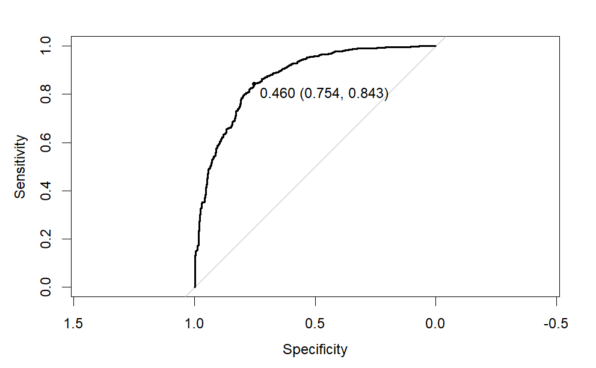
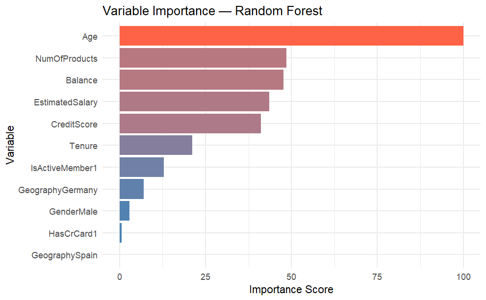

# Customer Churn Prediction — Classification with Caret

**STAT 376 | St. John Fisher University**  
Evan Scheuermann, Jake Scheidelman, Jack Tamburino

---

## Overview

Banks face significantly higher customer acquisition costs relative to retention,
making churn prediction a high-value classification problem. This project builds
and compares two machine learning algorithms — Random Forest and Naive Bayes —
alongside a stacked ensemble combining both, applied to a dataset of 10,000 bank
customers from Kaggle.

The goal was to identify customers likely to churn, with particular emphasis on
**maximizing sensitivity**: in a retention context, missing a churner is far more
costly than a false alarm.

## Data

- **Source:** [Bank Customer Churn Prediction](https://www.kaggle.com/datasets/saurabhbadole/bank-customer-churn-prediction-dataset) — Kaggle
- **License:** CC BY-NC-ND 4.0 — dataset not included in this repo
- **Size:** 10,000 observations, 13 predictor variables + churn indicator
- **Setup:** Download the dataset from Kaggle and place `Churn_Modelling.csv`
  in a `data/` folder in the project root before running the analysis.

**Preprocessing steps:**
- Removed non-predictive identifiers (RowNumber, CustomerID, Surname)
- Converted categorical variables to factors (Geography, Gender, HasCrCard,
  IsActiveMember, Exited)
- Scanned for multicollinearity using a 0.80 Pearson threshold — none found
- Stratified 80/20 train/test split on the response variable

## Methods

All models were trained using **3-fold repeated cross-validation (3 repeats)**
with **downsampling** to address class imbalance. Class probabilities were saved
to enable ROC-based evaluation.

### Random Forest
- Package: `ranger` via `caret`
- Tuned: `mtry` and minimum node size
- Optimal: `mtry = 4`, `min node size = 5`

### Naive Bayes
- Probabilistic baseline with strong variable independence assumption
- Tuned: Laplace smoothing (λ = 0, 0.5, 1) and kernel density estimation
- Optimal: `Laplace = 0.5`, Gaussian distribution (no KDE)

### Stacked Ensemble
- Meta-learner: logistic regression (`caretStack` via `caretEnsemble`)
- Separate CV loop used to prevent data leakage
- Both base models used same tuning parameters as individual implementations

## Results

### Fixed Threshold (0.5)

| Metric      | Random Forest | Naive Bayes | Ensemble |
|-------------|--------------|-------------|----------|
| Accuracy    | 80.2%        | 72.7%       | 86.1%    |
| Kappa       | 0.490        | 0.342       | 0.524    |
| Sensitivity | 77.9%        | 70.3%       | 52.6%    |
| Specificity | 80.8%        | 73.4%       | 94.7%    |

### Optimized Threshold (Random Forest)
Adjusting the classification threshold from 0.5 to **0.460** via ROC curve
analysis yielded:
- **ROC-AUC:** 86.8%
- **Sensitivity:** 84.3%
- **Specificity:** 75.4%

### Top Predictors (Random Forest)
Age, Balance, and Estimated Salary were the three most important features,
followed by Credit Score, Number of Products, and Tenure.

## Recommendation

**Random Forest with optimized threshold is the recommended model.**

The ensemble achieved higher accuracy and kappa but at a severe cost to
sensitivity (52.6%), which is the primary metric in a churn retention context.
Random Forest at the adjusted threshold delivers strong sensitivity while
maintaining solid specificity, and the added complexity of the ensemble is not
justified by its marginal gains elsewhere.

Naive Bayes underperformed across all metrics, likely because its variable
independence assumption broke down — Age, Balance, and Estimated Salary are
meaningfully correlated in practice.

## Tools & Packages

- **Language:** R
- **Packages:** `caret`, `caretEnsemble`, `ranger`, `ggplot2`, `tidymodels`

## Files

- `Group-Project.qmd` — Full analysis with code and narrative
- `Group-Project.pdf` — Rendered report
- `Customer Churn Poster.pdf` — Final poster presentation
- `figures/` — Output plots (ROC curve, variable importance, confusion matrix)

## References

- Kuhn, M. (2008). Building predictive models in R using the caret package. *Journal of Statistical Software.*
- Breiman, L. (2001). Random forests. *Machine Learning, 45*(1), 5–32.
- Johnson, K. & Kuhn, M. (2013). *Applied Predictive Modeling.* Springer.

## Contributors

Evan Scheuermann: Algorithm selection and planning, data cleaning, implementation and analysis of Random Forest,
ensemble implementation, algorithm comparison. Algorithm interpretation and explanation for poster.
Analysis and interpretation of performance metrics within applied business context.

Jake Scheidelman: Data cleaning and implementation of Naive Bayes. Analysis of Naive Bayes implementation and methodology.
Explanation of results within business context and analysis of overall performance/future direction.
Final poster review and editing.

Jack Tamburino: Output visualization (creating clean and understandable plots using ggplot2) for Random Forest and Naive Bayes. Explanations of plots and other visuals.
